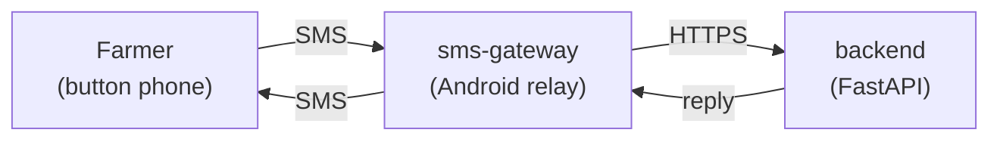

# Umurima AI

Farming advice over SMS for smallholder farmers in Rwanda who use basic feature phones.

A farmer texts a question, in Kinyarwanda or English, to an ordinary phone number. An
Android gateway phone relays it to the Umurima backend, which replies within seconds
with one concrete recommendation and the person to ask next, in at most two SMS. The
farmer needs no smartphone, no data bundle and no app.

Built for the Hack-Nation × World Bank *Small AI for Development* challenge
(agriculture track), October 2026.

## Why SMS

78% of Rwandan agricultural households own a mobile phone, but only 9% own a
smartphone and 16% have internet access. 32% of household heads cannot read or write
(NISR, Population and Housing Census 2022). Extension officers reach a village a few
times a year. The phone farmers already carry is the channel that reaches them.
Sources and coverage gaps are in [docs/data.md](docs/data.md).

## How it works



Each message passes through five layers, ordered by cost and risk. Only the fourth
needs a language model:

| # | Layer | What it does |
|---|---|---|
| 1 | Triage | Rules detect emergencies: a dying or poisoned animal, a person poisoned by pesticide, crops dying or a problem spreading. Life-at-risk cases get a fixed reply that sends the farmer to a vet or health centre. |
| 2 | Verified answers | 27 reviewed answers to the most common questions, returned verbatim. |
| 3 | Answer cache | Earlier model answers, matched on the question's intent rather than its exact wording. Persisted, and invalidated automatically when the knowledge base or prompt changes. |
| 4 | Retrieval + LLM | BM25 over the agronomy notes in `backend/knowledge/`, plus the farmer's last six messages, sent to a small hosted model. |
| 5 | Offline fallback | When the model is unreachable, the best-matching sentence from the notes, or an honest "try again". |

Every reply ends with a human contact (Farmer Promoter, sector agronomist or sector
vet). The code appends it, so the model has no reason to deflect a simple question,
and a person is always one SMS away. Design details are in
[docs/architecture.md](docs/architecture.md), guardrails in
[docs/responsible-ai.md](docs/responsible-ai.md).

## Repository layout

```
backend/        FastAPI service: triage, verified answers, cache, retrieval, LLM
  app/          one module per pipeline stage
  knowledge/    agronomy notes that answers are grounded in
  tests/
sms-gateway/    Flutter (Android) SMS relay: store-and-forward queue and operator dashboard
docs/           architecture, responsible AI, data sources, demo script
```

## Getting started

### Backend

Requires Python 3.12+.

```bash
cd backend
python -m venv .venv && . .venv/bin/activate
pip install -r requirements.txt
cp .env.example .env        # set OPENROUTER_API_KEY; DATABASE_URL is optional
pytest
uvicorn app.main:app --reload
```

```bash
curl -s localhost:8000/sms -H 'Content-Type: application/json' \
  -d '{"phone_number": "+250788000000", "message": "When should I plant maize?"}'
```

Without `DATABASE_URL` the service stores history in SQLite. Without
`OPENROUTER_API_KEY` it still answers from triage, verified answers, the cache and
the notes.

### SMS gateway

Requires Flutter 3.44+ and an Android phone with a SIM card.

```bash
cd sms-gateway
flutter pub get
flutter run --dart-define=API_BASE_URL=http://<backend-host>:8000
```

On the phone, tap **Start gateway** and grant the SMS and notification permissions
and the battery-optimization exemption. Then text the gateway's number from any
phone. **Test a question** on the dashboard sends a question to the backend without
sending an SMS.

## Configuration

| Variable | Where | Default | Purpose |
|---|---|---|---|
| `OPENROUTER_API_KEY` | backend | — | Model access. Layers 1–3 and 5 work without it. |
| `OPENROUTER_MODEL` | backend | `google/gemini-3.1-flash-lite` | Primary model. |
| `OPENROUTER_FALLBACK_MODEL` | backend | — | Tried when the primary model fails. |
| `DATABASE_URL` | backend | SQLite at `data/umurima.db` | Postgres for history and the answer cache. |
| `API_BASE_URL` | sms-gateway (`--dart-define`) | production backend | Backend the gateway talks to. |

## Deployment

The backend ships as a Docker image (`backend/Dockerfile`) and runs on Coolify with
Postgres. Coolify deploys from
[ai-sms-backend](https://github.com/Dawit-Getachew/ai-sms-backend), which mirrors
`backend/`. The gateway is distributed as a release APK:
`flutter build apk --release`.

## Testing

```bash
cd backend && pytest                       # pipeline, triage, cache, SMS limits
cd sms-gateway && flutter test             # queue and dashboard
```

## Status

This is a working prototype, not a production service. Before real farmers use it:

- RAB agronomists need to review the knowledge notes and verified answers. They are drafts written from public RAB, MINAGRI and NAEB guidance.
- A native-speaking agronomist needs to review the Kinyarwanda output. It is weaker than the English output.
- The service needs a consent message on first contact, a `STOP` command, authentication on `/sms` and rate limiting.
- It needs a telco short code, so one gateway phone is no longer a single point of failure.

## Acknowledgements

The challenge brief and evidence come from the World Bank Group Digital & AI Vice
Presidency and Hack-Nation. Design ideas were drawn from the
[World Bank AI Repository](https://airepository.worldbank.org/) agriculture cases.
Extension guidance comes from the Rwanda Agriculture and Animal Resources
Development Board (RAB), MINAGRI and NAEB. The vendored SMS plugin in
`sms-gateway/packages/telephony` is a fork of
[telephony](https://github.com/shounakmulay/Telephony) (MIT).

Team: CMU-Africa bootcamp, Group 7.
