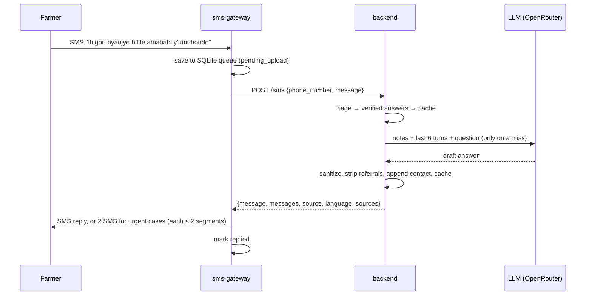

# Architecture

## Components

| Component | Runs on | Responsibility |
|---|---|---|
| Farmer's phone | Any GSM phone | Sends and receives plain SMS. Nothing to install. |
| `sms-gateway` | One Android phone with a SIM | Receives farmer SMS, queues them durably, calls the backend, sends the reply by SMS. |
| `backend` | Docker container (Coolify) | Turns one question into one reply of at most 300 characters. |
| Postgres | Managed by Coolify | Conversation history and the answer cache. SQLite when not configured. |
| OpenRouter | Third party | Hosted LLM (`gemini-3.1-flash-lite`), used only by pipeline layer 4. |

## Message lifecycle



## Backend pipeline

`app/advisor.py` orchestrates. Each stage is a small module:

| Stage | Module | Notes |
|---|---|---|
| Normalize | `nlp.py` | Folds Unicode to ASCII, detects English or Kinyarwanda, tokenizes. Kinyarwanda farm terms (*ibigori*, *inka*, *ifumbire*, *nkongwa*...) map to the English terms used in the notes. |
| Small talk | `advisor.py` | Greetings, thanks and empty messages get fixed replies. A first message with no crop, animal or symptom gets a request for detail. |
| Triage | `triage.py` | Word and phrase rules. `human` returns one fixed reply. `livestock` and `crop` return two SMS: a generated safe step, then a fixed escalation from `replies.py`. Animal steps that name a drug, dose or number are replaced with a fixed step. Prevention questions ("how do I prevent...") are excluded. |
| Verified answers | `faq.py` | 27 entries. A question matches when it hits every word group of an entry and adds at most one unrelated term, so detailed questions go to the model instead. English only. |
| Answer cache | `cache.py` | See below. |
| Retrieval | `rag.py` | BM25 (`rank-bm25`) over 68 paragraphs from `knowledge/*.md`. "When" questions are boosted toward the season calendar. A follow-up like "what should I do?" is searched together with the farmer's previous message. |
| Generation | `llm.py` | One call, temperature 0.2, 200 max tokens, optional fallback model. The prompt asks for one practical recommendation under 220 characters and forbids invented doses, prices, dates and phone numbers. |
| Post-processing | `llm.py`, `sms.py` | Removes short "ask your Farmer Promoter" sentences (the footer covers them), folds to ASCII, trims at a sentence boundary, appends the contact line so it is never the part cut off. |
| Offline fallback | `advisor.py`, `rag.py` | Loose cache match, then an extractive answer: the sentence from the top notes that covers most of the question's terms. |

### Answer cache

- **Key**: language plus the sorted intent terms of the question, with stopwords removed but question words kept. "When should I plant maize?" and "when to plant maize" share a key; "how to plant maize" does not.
- **Fuzzy match**: Jaccard similarity of term sets ≥ 0.8 normally, and ≥ 0.6 when the model is unreachable.
- **Not cached**: follow-ups ("and for beans?"), questions with pronouns, urgent crop answers, and answers where the model said it was not sure.
- **Versioning**: every entry stores a hash of the notes, the system prompt and the model name. Changing any of them retires all older entries on the next start.
- **Storage**: kept in memory and persisted to `answer_cache`. Capped at 5,000 entries, oldest evicted first.
- **Retry window**: the same SMS from the same phone within two minutes returns the earlier answer. This absorbs gateway retries after a lost response without a second model call.

### Storage

```sql
messages     (id, phone, role, content, created_at)                 -- last 6 turns per phone
answer_cache (key, lang, terms, question, answer, version, updated_at)
```

Postgres when `DATABASE_URL` is set and reachable at boot, after 5 attempts. Otherwise
SQLite at `SQLITE_PATH` (default `data/umurima.db`). The service never fails to start
because of the database.

## SMS gateway

- **Queue**: every SMS is written to SQLite before any network call. States are
  `pending_upload → uploading → uploaded → replied`, or `failed` with a reason. A row is
  claimed (`uploading`) before upload, so the 15-second retry sweep cannot send it twice.
  Rows stranded in `uploading` for 5 minutes are reclaimed.
- **Background**: a foreground service (`flutter_background_service`) runs the sweep. The
  `telephony` plugin's background handler receives SMS while the app is closed or the
  screen is locked.
- **Sending**: always multipart, so a reply longer than one segment is never dropped
  silently. When the backend splits a reply (`messages` has two entries), the parts go
  out as separate SMS two seconds apart, numbered (1/2) and (2/2).
- **Dashboard**: shows gateway and backend status, counts, and every conversation with
  its reply and how it was produced. Failed messages can be retried.

## Failure modes

| Failure | Behaviour |
|---|---|
| Gateway has no network | SMS waits in the queue and is answered when the connection returns. |
| Backend down | Same as above; the gateway keeps retrying. |
| LLM down or slow | Fallback model if configured, then loose cache, then an extract from the notes, then "try again" plus a contact. `/sms` still returns 200. |
| Database down | Replies are still sent; history and caching are skipped. At boot the service falls back to SQLite. |
| Response lost after the backend answered | The retry window returns the same answer without a second model call. |
| Gateway phone lost | Queued messages on the device are exposed; see [responsible-ai.md](responsible-ai.md#privacy). |

## Size and cost

- **Size**: the knowledge base is about 20 KB of text and the BM25 index is built in memory at start-up. Triage, verified answers, the cache and the offline fallback run without the model.
- **Model calls**: one per uncached question. Measured on 2026-10-04: 705 prompt tokens without history (up to about 1,000 with six turns), 30 to 80 completion tokens, and US$0.00022 per answer, about US$0.22 per 1,000 uncached answers. SMS charges are not included.
- **Latency**: 1 to 3 seconds per model answer in testing. Verified and cached answers return in milliseconds.
